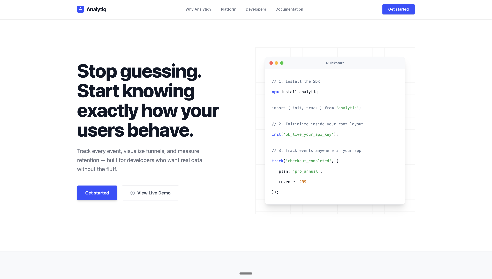
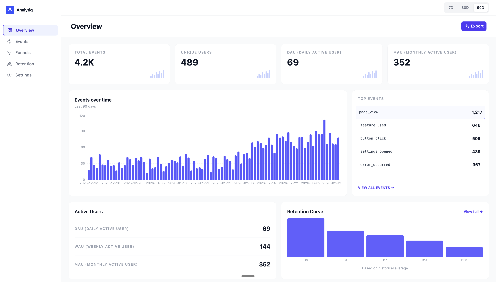
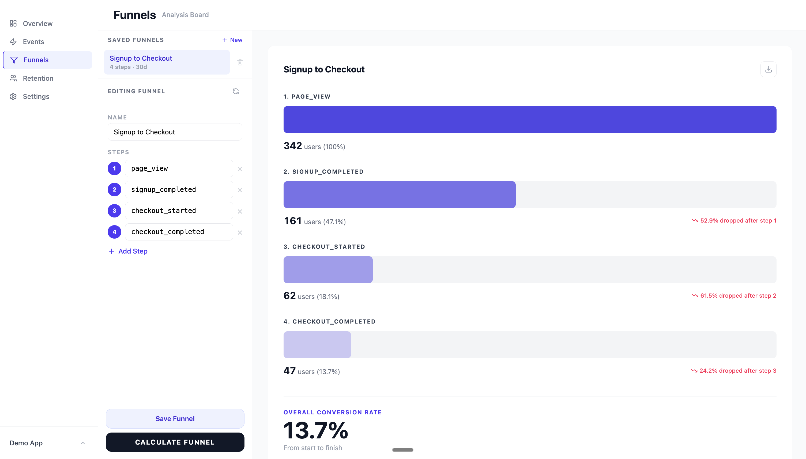
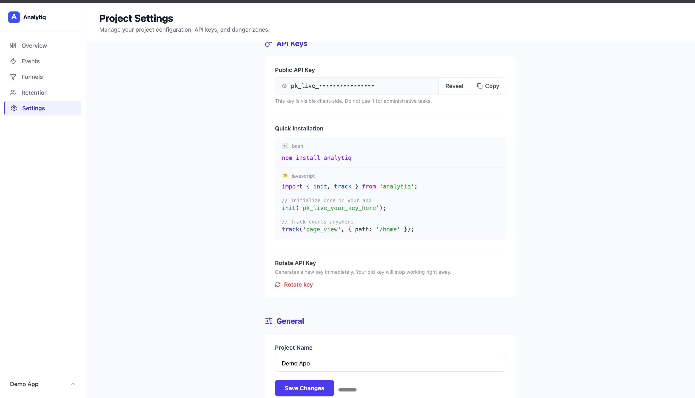
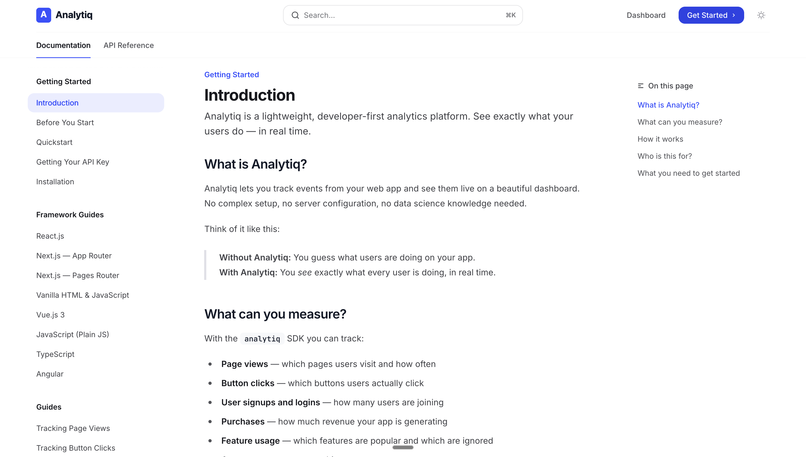
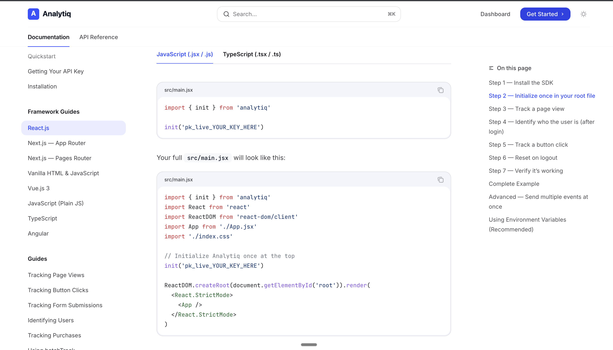

<div align="center">

# Analytiq

**A product analytics platform built for teams.** <br/>
See exactly what your users do — in real time.

[](https://analytiq-two.vercel.app/)
[](https://bhavishaya.mintlify.app/)

</div>

Analytiq is a product analytics platform focused on one thing: helping you understand how users actually behave inside your product. It tracks events (like button clicks, purchases, and page views), stores them in your own database, and turns that raw data into live insights on your dashboard.

The platform has three parts that work together:

**The SDK** (`analytiq` on npm) is an npm package you install in your web app. It sends event data to your backend whenever users do something. It also handles offline queuing automatically and links each event to a specific user so you can track individual journeys.

**The Backend** is a Node.js + Express API that receives events and stores them in your MongoDB instance. Each event is saved with the user's ID, timestamp, event name, and any custom properties (like `{ plan: "pro" }`). The API also securely handles batch ingestion.

**The Dashboard** reads your event data using MongoDB aggregation pipelines and shows it in real time. You can quickly see daily active users, top events, step-by-step funnel drop-offs, and weekly cohort retention tables.

---

## Screenshots

### Landing Page


### Dashboard Overview


### Funnels & Drop-offs


### Projects & Settings


### Documentation Intro


### Framework Setup Guides


---

## Key Features

*   **Real-Time Tracking:** Events show up on your dashboard within 5–10 seconds.
*   **Own Your Data:** Full control over your event data using your own MongoDB instance.
*   **SDK:** An npm package (`analytiq`) with queueing, batching, and auto-retries.
*   **Powerful Dashboard:** Custom charting built with Recharts for DAU/WAU/MAU, Top Events, and Trends.
*   **Funnel Analysis:** See exactly where users drop off in multi-step processes.
*   **Retention Matrices:** Weekly Cohort Retention tables calculated automatically.
*   **Secure Authentication:** Standard Email/Password login combined with Google OAuth SSO.

---

## Tech Stack

This project is organized as a monorepo and uses a modern JavaScript stack:

### Frontend (`/client`)
*   **Core:** React 18, Vite
*   **Styling:** Tailwind CSS
*   **Data Visualization:** Recharts
*   **Routing:** React Router v6
*   **State Management:** React Context API
*   **Icons:** Lucide-React

### Backend (`/server`)
*   **Core:** Node.js, Express.js
*   **Database:** MongoDB, Mongoose
*   **Auth:** JSON Web Tokens (JWT), Google Auth Library, bcryptjs
*   **Security:** Helmet, express-rate-limit, CORS

### SDK & Documentation (`/sdk` & `/docs`)
*   **Bundler:** `tsup` (compiles to CommonJS, ESM, and IIFE)
*   **Docs Engine:** Mintlify

---

## Project Structure

```text
analytics/
├── client/                 # Frontend React Application
│   ├── src/
│   │   ├── components/     # Reusable UI elements (Sidebar, Charts, Modals)
│   │   ├── context/        # Auth and Project global state
│   │   ├── pages/          # Full page routes (Dashboard, Funnels, Retention)
│   │   └── services/       # Axios API interceptors and fetching logic
│   └── index.html          # Vite entry point
│
├── server/                 # Backend Express API
│   ├── src/
│   │   ├── controllers/    # Route business logic (auth, analytics, events)
│   │   ├── middleware/     # Auth guards, API key validators, rate limiters
│   │   ├── models/         # Mongoose Schemas (User, Project, Event)
│   │   ├── routes/         # Express route definitions
│   │   └── services/       # Complex MongoDB aggregation queries
│   └── server.js           # Express instance and DB connection
│
├── sdk/                    # Official Analytiq NPM Package
│   ├── src/
│   │   └── index.js        # Core SDK logic (init, track, identify, reset, batchTrack)
│   ├── dist/               # Bundled outputs ready for publishing
│   └── package.json
│
└── docs/                   # Mintlify Documentation Site
    ├── api-reference/      # Function signatures
    ├── frameworks/         # React, Next.js, Vue integration guides
    ├── guides/             # Task specific guides (Tracking page views, users)
    └── mint.json           # Navigation configuration
```

---

## Architecture Flow

<div align="center">
  
</div>

---

## Getting Started (Local Development)

Follow these steps to run the full platform locally.

### Environment Variables (.env)
Configure these variables in their respective directories before starting the apps:

| Variable | Location | Description |
| :--- | :--- | :--- |
| `PORT` | `/server` | Backend API port (default: 5000) |
| `MONGODB_URI` | `/server` | Your MongoDB connection string |
| `JWT_SECRET` | `/server` | Secret key used to sign Auth tokens |
| `CLIENT_URL` | `/server` | Frontend URL for CORS (default: http://localhost:5173) |
| `GOOGLE_CLIENT_ID` | `/server` & `/client` | Google OAuth credentials for SSO |
| `VITE_API_URL` | `/client` | Backend API endpoint |

### 1. Prerequisites
Make sure you have these installed:
*   [Node.js](https://nodejs.org/) (v18 or higher recommended)
*   [MongoDB](https://www.mongodb.com/) (Local instance or MongoDB Atlas URI)

### 2. Clone the Repository
```bash
git clone https://github.com/bhavishyaone/analytics.git
cd analytics
```

### 3. Backend Setup
```bash
cd server
npm install
```
Create a `.env` file in the `/server` directory:
```env
PORT=5000
MONGODB_URI=mongodb://localhost:27017/analytiq
JWT_SECRET=your_super_secret_jwt_key
CLIENT_URL=http://localhost:5173
GOOGLE_CLIENT_ID=your_google_oauth_client_id
```
Start the server:
```bash
npm run dev
```

### 4. Frontend Setup
Open a new terminal window:
```bash
cd client
npm install
```
Create a `.env` file in the `/client` directory:
```env
VITE_API_URL=http://localhost:5000/api
VITE_GOOGLE_CLIENT_ID=your_google_oauth_client_id
```
Start the frontend:
```bash
npm run dev
```
The dashboard will be running at `http://localhost:5173`.

### 5. SDK Setup (Optional: Testing the SDK locally)
If you want to test the SDK source code inside another local app:
```bash
cd sdk
npm install
npm run build
npm link
```
Then in your test project: `npm link analytiq`.

---

## Usage & Documentation

Integrating the SDK into your app is straightforward. For full guides, check the [Official Documentation](https://bhavishaya.mintlify.app/).

### Install

First, install the package:
```bash
npm install analytiq
```

### Core SDK (Vanilla JS / Vue)

Initialize once, identify users after login, then track events:

```javascript
import { init, track, identify } from 'analytiq';

// 1. Initialize with your project's API key
init('pk_live_YOUR_API_KEY');

// 2. Identify users when they log in
identify('user_12345');

// 3. Track events
track('purchase_completed', { plan: 'pro', amount: 29 });
```

### React / Next.js

Use the React package and initialize once with the `Analytiq` component:

```javascript
import { Analytiq, identify, reset, track } from 'analytiq/react';
import { useEffect } from 'react';

export function AnalyticsProvider({ children, user }) {
  useEffect(() => {
    if (user) identify(user.id);
    else reset();
  }, [user]);

  return (
    <>
      <Analytiq apiKey={import.meta.env.VITE_ANALYTIQ_KEY} />
      {children}
    </>
  );
}

export { track };
```

### Batch Tracking

Use `batchTrack` to send an array of events in one request:

```javascript
import { batchTrack } from 'analytiq';

batchTrack([
  { name: 'button_click', properties: { button: 'pricing_tier_2' } },
  { name: 'page_view', properties: { path: '/pricing' } },
  { name: 'video_played', properties: { video_id: 'intro_demo' } },
]);
```

### API Reference

- `init(apiKey, options?)`
- `identify(userId)`
- `track(eventName, properties?)`
- `batchTrack(events[])`
- `reset()`

Full docs:
- https://bhavishaya.mintlify.app/

---

## Author

**Bhavishya Sharma**
*   GitHub: [@bhavishyaone](https://github.com/bhavishyaone)

